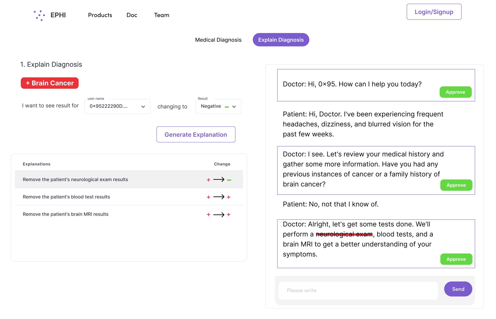
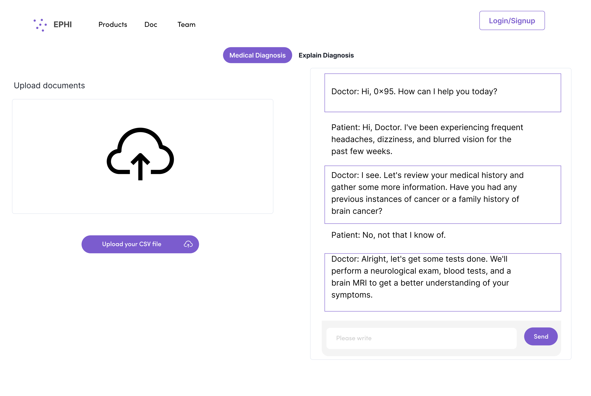

# EPHI Explaianbel Private Healthcare Infra (LLM)

## Product Demo
What doctors will see:


What patients will see:



## Pseudocode
```python
initialize_chatbot()
set_chatbot_personality("doctor's assistant")
patient_data = get_patient_data()

// First Iteration
diagnosis_result = chatbot_identify_issue(patient_data)
iteration_results = [diagnosis_result]

// Additional Iterations
for i in range(MinNumberOfIterations - 1):
    masked_data = apply_mask(patient_data, i)
    new_diagnosis_result = chatbot_identify_issue(masked_data)
    iteration_results.append(new_diagnosis_result)

// Output Results
output_results(iteration_results)

```


The algorithm initializes the language model using the `initialize_chatbot()` function, and sets the personality prompt for the chatbot using `set_chatbot_personality(personality_prompt)`. The `get_patient_data()` function retrieves the medical records of a patient.

For the first iteration, the `chatbot_identify_issue(patient_data)` function is called to instruct the chatbot to identify the main issue in the patient data and output a diagnosis with supporting arguments. The resulting diagnosis is stored in `diagnosis_result`.

In subsequent iterations, the algorithm applies a mask algorithm to the patient data using `apply_mask(patient_data, i)`, which drops some data points to simulate a smaller dataset. The masked data is then passed to `chatbot_identify_issue(masked_data)` to obtain a new diagnosis result, which is stored in `new_diagnosis_result`.

Finally, the `output_results(iteration_results)` function is called to output all the gathered diagnosis results from each iteration of the algorithm.
